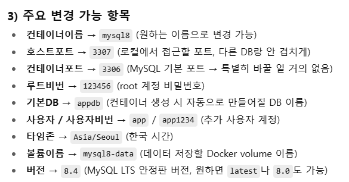

docker run -d --name (컨테이너이름:mysql8) ^
  --restart unless-stopped ^
  -p (호스트포트:3307):(컨테이너포트:3306) ^
  -e MYSQL_ROOT_PASSWORD=(루트비번:123456) ^
  -e MYSQL_DATABASE=(기본DB:appdb) ^
  -e MYSQL_USER=(사용자:app) ^
  -e MYSQL_PASSWORD=(사용자비번:app1234) ^
  -e TZ=(타임존:Asia/Seoul) ^
  -v (볼륨이름:mysql8-data):/var/lib/mysql ^
  mysql:(버전:8.4) --default-authentication-plugin=mysql_native_password

